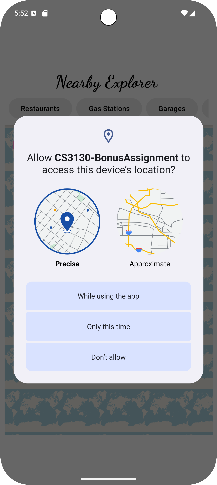

# Nearby Explorer 
Nearby Explorer is an Android application that helps users discover nearby points of interest using Mapbox.

  
  
  
  
  

## Technology Stack

- **Language:** Kotlin  
- **Minimum SDK:** 21 (Android 5.0 Lollipop)  
- **Target SDK:** 33 (Android 13)  
- **Map:** Mapbox Maps SDK for Android  
- **Location:** Google Play Services Location API  
- **Navigation:** Jetpack Navigation Component  
- **UI:** Material Design Components, ConstraintLayout, RecyclerView  
- **Async:** Kotlin Coroutines  
- **Search/Network:** Mapbox Search SDK 

## Core Components

| Component            | Description                                     |
|---------------------|--------------------------------------------------|
| `MainActivity`       | Hosts the `NavHostFragment`                     |
| `MapFragment`        | Displays the interactive map and search results |
| `PlaceDetailFragment`| Shows detailed information for a selected place |
| `MainViewModel`      | Manages UI state and app logic                  |
| `MapboxSearchService`| Handles search queries using Mapbox APIs        |
| `Place`              | Data class representing a point of interest     |
| `PlaceAdapter`       | Binds search results to the RecyclerView        |
| `MarkerUtils`        | Utility for adding custom markers to the map    |
